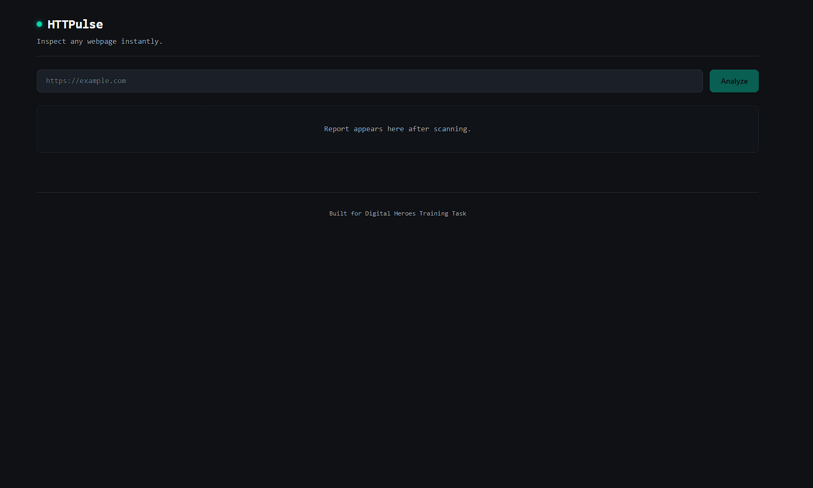
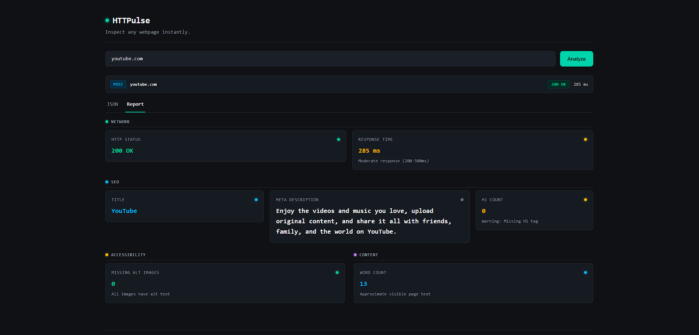
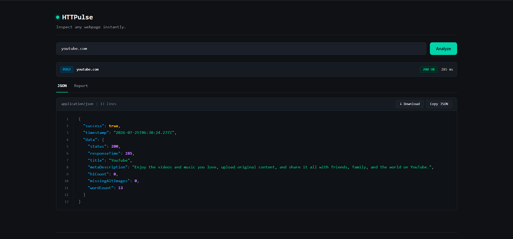
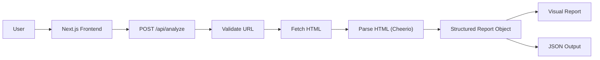

# HTTPulse

<p align="center">
  <strong>A lightweight webpage inspection tool that analyzes public webpages and presents structured insights through an interactive dashboard.</strong>
</p>

<p align="center">
  Built with <strong>Next.js</strong>, <strong>TypeScript</strong>, <strong>Tailwind CSS</strong>, <strong>Cheerio</strong> and <strong>Vitest</strong>.
</p>

<p align="center">
  <a href="https://httpulse.vercel.app/">Live Demo</a>
  •
  <a href="https://github.com/tanishk0/HTTPulse">GitHub Repository</a>
</p>

---

## Table of Contents
- [Screenshots](#screenshots)
- [Overview](#overview)
- [Engineering Principles](#engineering-principles)
- [Features](#features)
- [Tech Stack](#tech-stack)
- [Architecture](#architecture)
- [Project Structure](#project-structure)
- [Getting Started](#getting-started)
- [Running Tests](#running-tests)
- [API Contract](#api-contract)
- [Testing](#testing)
- [Design Decisions](#design-decisions)
- [Assumptions](#assumptions)
- [Credits](#credits)

---

## Screenshots

### Homepage



### Report Dashboard



### JSON Output



---

## Overview

HTTPulse is a lightweight webpage inspection tool that analyzes publicly accessible webpages and converts raw HTML into structured reports.

Given a URL, HTTPulse retrieves the webpage, extracts page structure, accessibility, network, and content metrics, then presents the results through an interactive dashboard and JSON output.

The project emphasizes modular architecture, consistent API design, and independently testable parsing logic.

---
 
# Engineering Principles

HTTPulse was built around four guiding principles:

- Keep business logic independent from HTTP handling.
- Return predictable API responses.
- Make core logic easy to test.
- Prioritize a simple developer experience.

---

# Features

## Network

- HTTP Status Code
- Response Time

## Page Structure

- Document Title
- Meta Description
- Heading Count (H1)

## Accessibility

- Images Missing Alt Text

## Content

- Approximate Visible Word Count

## Developer Experience

- Visual Report Dashboard
- Raw JSON Viewer
- Copy JSON
- Download JSON
- Consistent Error Responses

---

# Tech Stack

| Category | Technology |
|-----------|------------|
| Framework | Next.js (App Router) |
| Language | TypeScript |
| Styling | Tailwind CSS |
| HTML Parsing | Cheerio |
| Testing | Vitest |

---

# Architecture



---

# Project Structure

```text
.
├── app/
├── components/
├── lib/
├── types/
├── __tests__/
└── public/
```

---

# Getting Started

## Clone the Repository

```bash
git clone https://github.com/tanishk0/HTTPulse.git

cd HTTPulse
```

---

## Install Dependencies

```bash
npm install
```

---

## Start the Development Server

```bash
npm run dev
```

Open:

```
http://localhost:3000
```

---

# Running Tests

Run the complete parser test suite:

```bash
npm test
```

or

```bash
npx vitest run
```

The project currently includes **22 unit tests** covering both expected behaviour and failure scenarios.

---

# API Contract

## Endpoint

```http
POST /api/analyze
```

---

## Request Body

```json
{
  "url": "https://openai.com"
}
```

---

## Success Response

```json
{
  "success": true,
  "timestamp": "2026-07-24T16:08:32.494Z",
  "data": {
    "status": 200,
    "responseTime": 109,
    "title": "OpenAI",
    "metaDescription": "...",
    "h1Count": 0,
    "missingAltImages": 0,
    "wordCount": 315
  }
}
```

---

## Error Response

```json
{
  "success": false,
  "error": {
    "code": "INVALID_URL",
    "message": "Please enter a valid URL."
  }
}
```

---

## Supported Error Codes

| Error Code | Description |
|------------|-------------|
| EMPTY_URL | Empty input |
| INVALID_URL | Invalid URL |
| UNSUPPORTED_PROTOCOL | Unsupported protocol |
| DNS_FAILURE | Unable to resolve domain |
| CONNECTION_REFUSED | Connection refused |
| NETWORK_FAILURE | Generic network failure |
| SSL_ERROR | SSL verification failed |
| REQUEST_TIMEOUT | Request timed out |
| TOO_MANY_REDIRECTS | Redirect limit exceeded |
| NON_HTML_CONTENT | Response is not an HTML document |
| HTTP_404 | Resource not found |
| HTTP_500 | Server error |
| SERVER_ERROR | Internal application error |

---

# Testing

The parsing logic is isolated from the API layer and covered by a dedicated Vitest suite.

Current test coverage includes:

- Document title extraction
- Meta description extraction
- Heading count (H1)
- Missing image alt detection
- Visible word counting
- Empty HTML documents
- HTML fragments
- Malformed HTML
- Edge cases
- Parser robustness

---

# Design Decisions

## 1. Parsing Logic Separated from the API Layer

The HTML parsing logic lives independently of the API route. The API endpoint is responsible for request handling, while the parser focuses solely on extracting webpage information.

This separation keeps responsibilities clear, makes the parser independently testable, and allows additional metrics to be added without modifying the endpoint.

---

## 2. Consistent API Contract

Every request returns a predictable response structure, regardless of whether the operation succeeds or fails.

This simplifies frontend logic, improves maintainability, and makes the API easier to integrate with other clients.

---

## 3. Centralized Validation and Error Handling

Input validation and network error mapping are handled through dedicated utility modules instead of being scattered throughout the API route.

This keeps the endpoint concise, ensures consistent error responses, and makes it easier to introduce new validation rules or error cases without changing endpoint logic.

---

# Assumptions

- Only publicly accessible webpages are supported.
- Only HTTP and HTTPS URLs are accepted.
- Only HTML documents are analyzed.
- Word count represents approximate visible page content.
- JavaScript-rendered content may not be fully captured.

---

# Credits

Built as part of the **Digital Heroes SDE Training Qualification Task**.

https://digitalheroesco.com